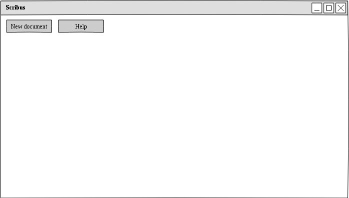
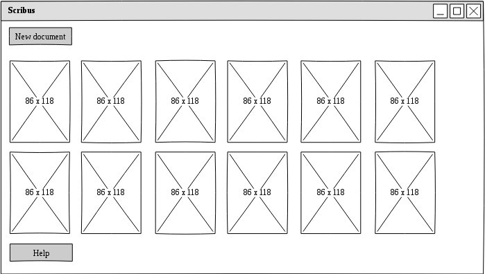
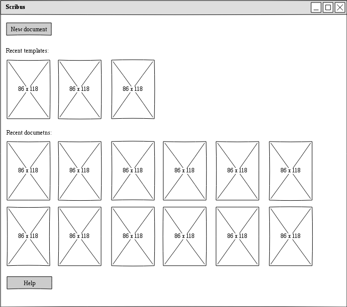
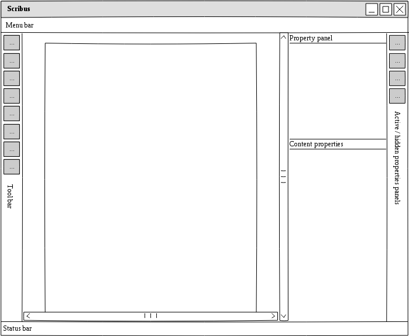

# The Scribus Desktop

## Starting Scribus

When Scribus is started without any file to be opened, the Desktop should "contain" shortcuts for the most common actions.

First start:

Desktop with recent documents:

Desktop when templates have been recently been used:

### Description

- A putton at the top to create a new file
- A button to get contextual help
- Preview of the recent documents and templates.
- Toolbars and palettes should all be hidden.
- All furter available actions can be reached through the menus.

Remarks:

- On mouse over, a "Trash" icon appears in the top right corner of the preview
Optionally don't show the list of latest documents

### Actions

There are three common action for the user:

- Press on the "New" button to create a new file.
- Click on one of the previews for the recent saved files (or recent "opened files") to open the matching files.
- Use ctrl-o or ctrl-n to open an existing file or create a new one.
- Press on the help button to get to a "Welcome" / "First tutorial" dialog.

### Options

Eventually:

- Add a button a button for the "Open" dialog (but the "New" button with the recent files to be opened could be enough; The "Open" dialog could be reached through the menu or the keyboard shortcut).

## Configuration

- Optionally don't show the list of latest documents
- Optionally show a list instead of the previews grid

### Inspiration sources

Both Libreoffice 5.2 and Pencil 3.0 provide very inspiring solutions.

## Desktop with document

By default Scribus shows:

- The tools toolbar on the left side
- The Content and Properties docked to the right side
- The docuemnt in the middle.

# Open questions

- Should the list of open palettes be linked to the document or to the Scribus instance?
- Should the resource windows also be restored?
